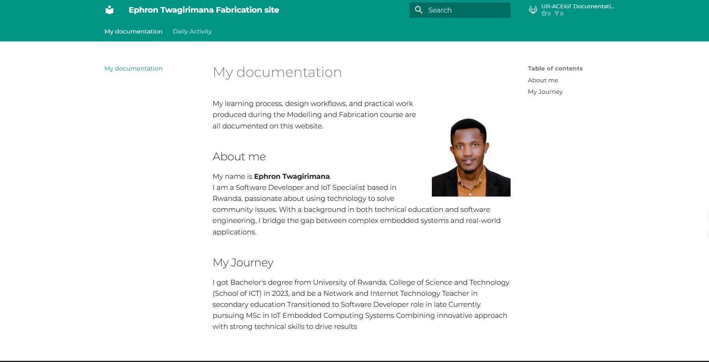
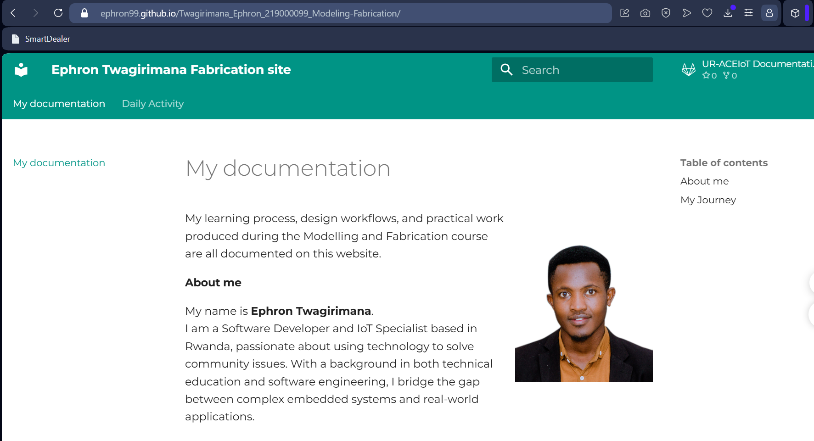

# 1. Activity of Day 1

#### Activity 1: Building a Documentation Website with MkDocs Material

Documentation is important in engineering and fabrication projects because it allows users and developers to understand how a system works. In this task, a documentation website was created using MkDocs with the Material for MkDocs theme. MkDocs is a static site generator designed for building project documentation using Markdown files. The Material theme enhances MkDocs by providing a modern interface, navigation features, and responsive design.
I Used Python,MkDocs and Material for MkDocs as Tools and Technologies

###### Installation Process I used

- Install Python: python --version/pip --version

- Install MkDocs: pip install mkdocs (verify by "mkdocs --version")
- Create a New MkDocs Project by using "mkdocs new my-project-name" command
- Installing Material Theme: pip install mkdocs-material
- Running the Documentation Website: mkdocs serve

- **My Web Pages**

{ width=600}

#### Activity 2: Publishing Documentation via GitHub Pages 

After creating a documentation website using MkDocs, the next step was to publish the documentation online so it could be accessed by others through the internet. This was done using GitHub Pages, a service provided by GitHub that allows users to host static websites directly from a repository.
I used Git, GitHub and GitHub Pages. I Created a GitHub Repository to my GitHub account, Initialize Git in the Project Folder by using Git commands in the **Git Bash terminal:** *git init*, *git add .*, *git add .*,*git commit -m ""*, *git remote add origin https://github.com/Ephron99/Twagirimana_Ephron_219000099_Modeling-Fabrication.git*, *git push -u origin main*. then Deploy the Site Using MkDocs *mkdocs gh-deploy*

{ width=600}

#### Activity 3: Peer Review

In this activity, I reviewed the documentation website created by Mr. Emile, which was developed using MkDocs with the Material for MkDocs and published via GitHub Pages on GitHub. The documentation included well-organized sections for activities and tasks, The pages loaded correctly, and the website was accessible online. 
This peer review activity helped me understand the importance of clear structure, detailed explanations, and visual support in technical documentation. Reviewing another student’s work also provided ideas that I can use to improve my own documentation website.

