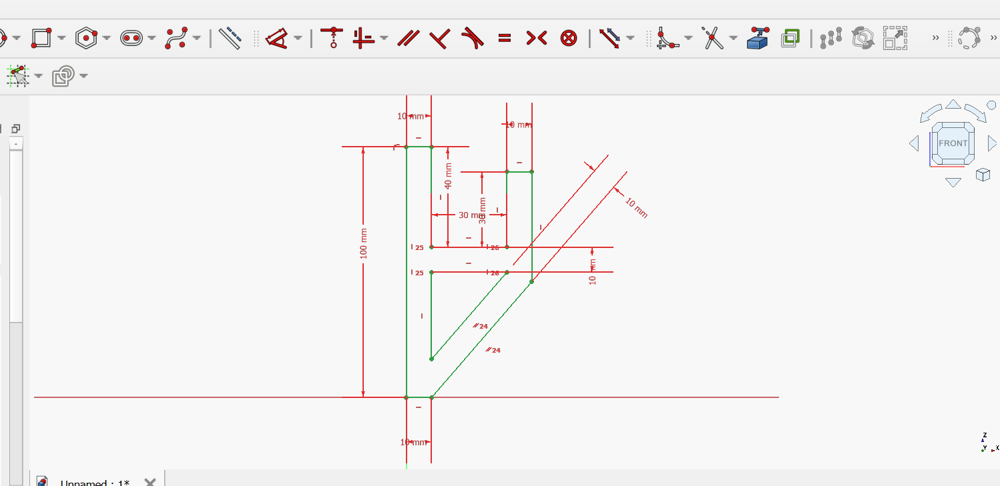
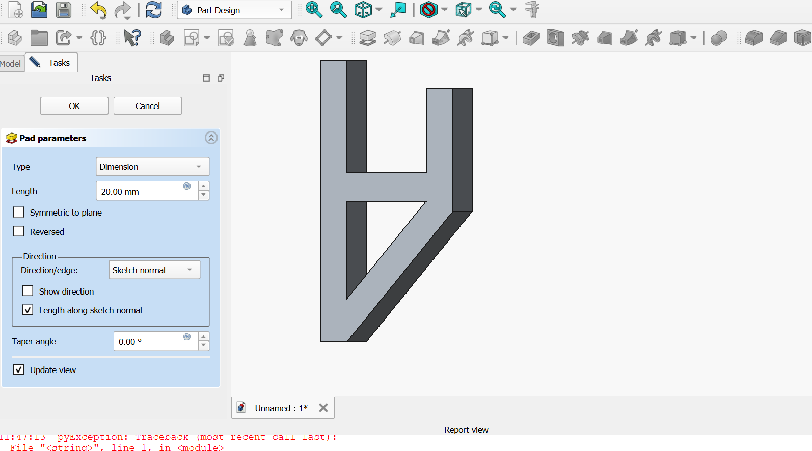
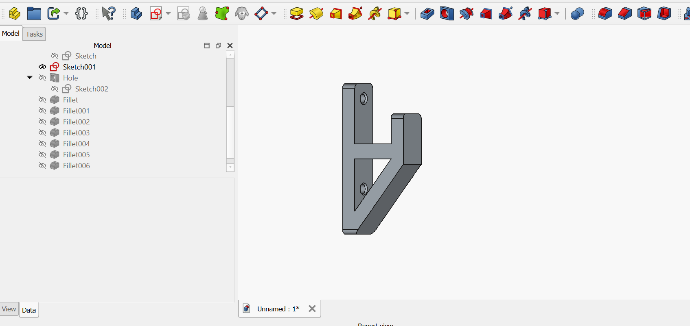

# 2. Activity of Day 2

# Digital Modeling for Fabrication

Digital modeling allows designers to create precise virtual models before producing physical objects. 
#### Activity 1: Creating an L-Shaped Mounting Bracket in 3D Using FreeCAD

In this activity, a 3D model of an L-Shaped Mounting Bracket was created using FreeCAD.
An L-shaped mounting bracket is a mechanical component commonly used to support or connect two structures at a 90-degree angle. It usually contains holes for screws or bolts so that it can be fixed to surfaces such as walls, frames, or machines.

I Created a new Body and Sketch.

{ fgjhfdsdfsd=600 align=center }

I Applied the Pad on object.

{ fgjhfdsdfsd=600 align=center }

The final design produced a 3D L-shaped with holes and Fillet.
{ width=600 align=center }

#### Activity 2: Designing a 2D Vector Press-Fit Box Panel
In this activity, I designed a press-fit box panel  using Inkscape.
 
{ width=600 align=center }

[ FreeCad Project](../files/Day2_Activity_L-Shaped_Project.FCStd){: .md-button:download }

[ Press-Fit Box Panel](../files/Day2_press-fit_box.svg){: .md-button:download }

