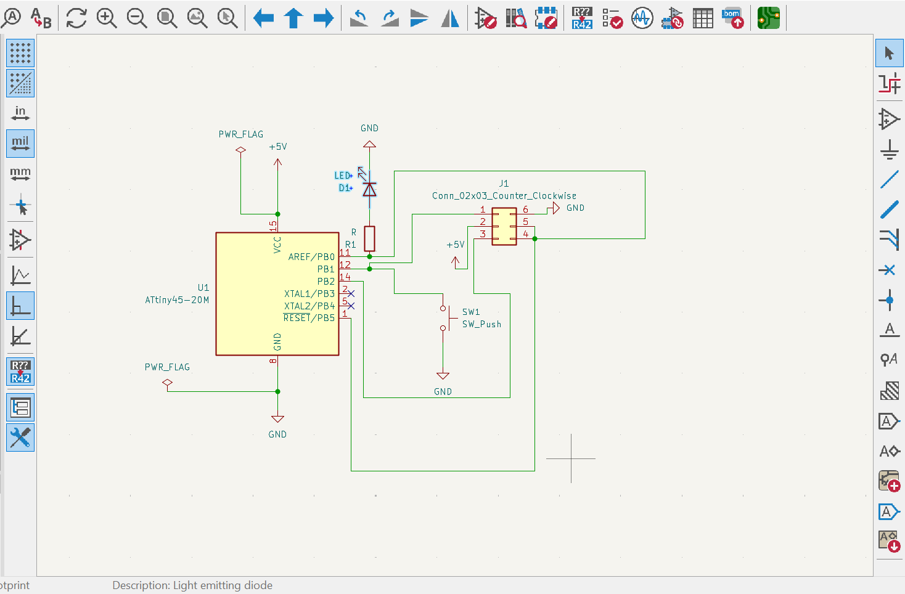
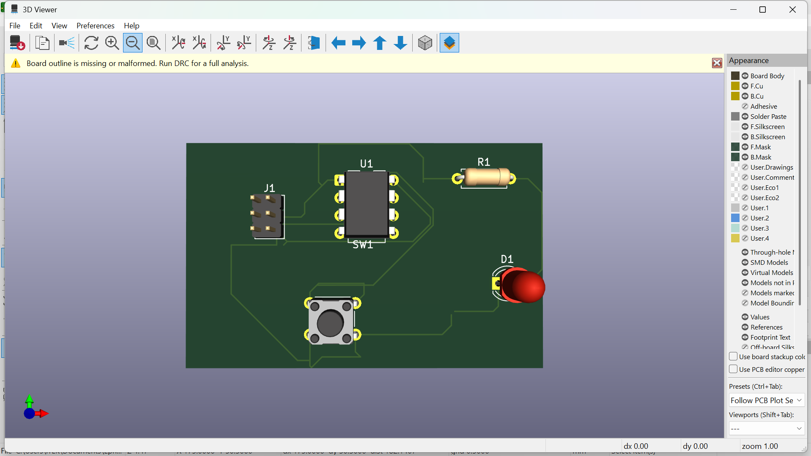
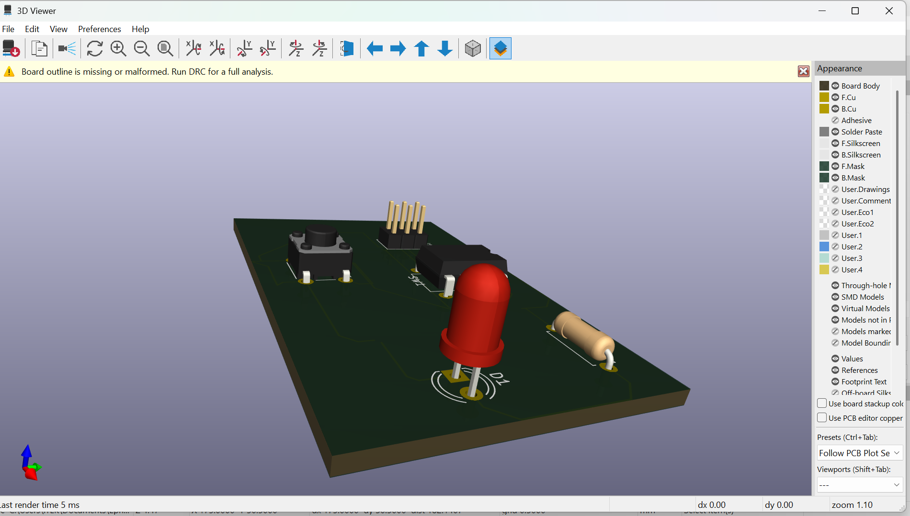

# 3. Activity of Day 3

#### PCB Milling Techniques & Fabrication Process

On Day 3, we studied Printing Circuit Board (PCB) design as a fundamental step in electronics fabrication. 

####  Activity
###### Single-Sided Microcontroller PCB Design using Kicad

In this activity, I designed a single-sided microcontroller board using KiCad.

I used ATtiny45 as board  and push button for user input, LED for output indication and ISP programming header for firmware uploading. The push button sends a signal to the microcontroller, which then controls the LED.

## PCB Schematic
{ width=500 align=center }

## PCB layout
{ width=500 align=center }

## PCB in 3D view
{ width=500 align=center }

{ width=500 align=center }

[ This is kicad zipped folder:](../files/attiny45_led_button.zip){: .md-button:download }

