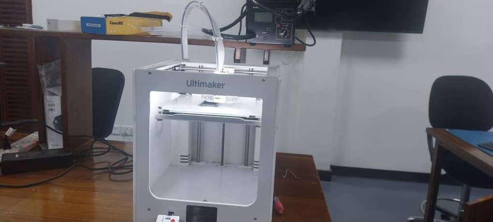
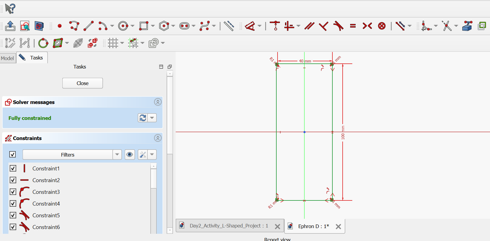
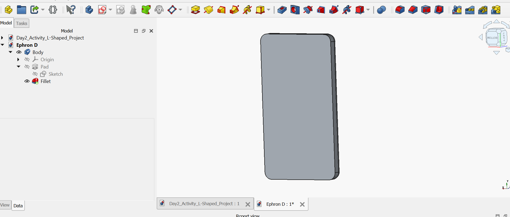
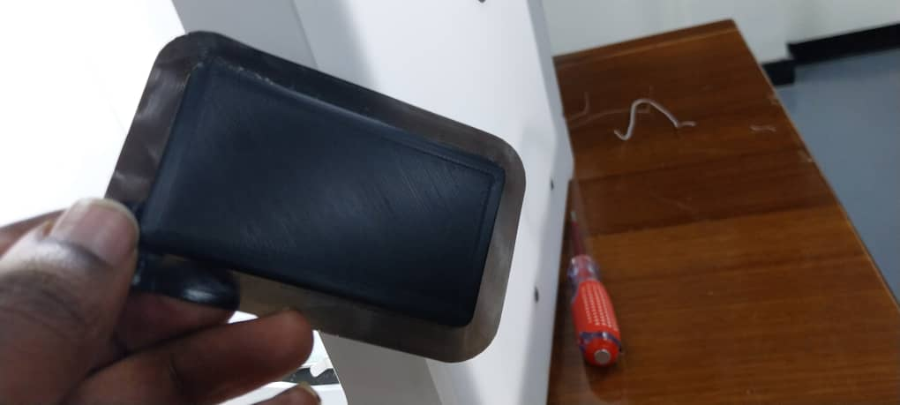

# 6. Activity of Day 6

##  Digital Fabrication II: Additive Manufacturing

#### Overview

Additive manufacturing, commonly known as 3D printing, is a digital fabrication process where objects are created by depositing material layer by layer according to a digital model. Unlike subtractive manufacturing methods such as milling, additive manufacturing builds the object gradually, which reduces material waste and allows the creation of complex shapes.

In this session, we learned how to fabricate objects using a Ultimaker 3D Printer. The printer produces physical objects from digital designs using thermoplastic filament materials.

The following is Ultimaker 3D Printer
{ width=510 align=center } 

#### Preparing the Model for Printing

A model designed using FreeCAD exported in STL format. The STL file is opened in slicing software such as Ultimaker Cura. Slicing software converts the model into G-code, which the printer uses to control printing movements.

The following images are an object in FreeCAD

{ width=310 align=left }  { width=330 align=right }

!!!After 

**After printing** we Remove the printed object from the build plate and Clean  the surface.

From this activity, I gained the ability to understand the principles of additive manufacturing, Preparing models for 3D printing and Operating 3D printer

**Printed 3D object**

{ width=600 align=center } 

